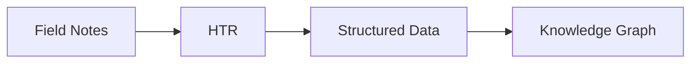

<!-- .slide: data-background="black" -->

# Practical Necromancy
## Digital Archaeology and AI

---

<!-- .slide: data-background="black" -->

> My first excavation involved a vampire...

Note: Bones arranged according to Balkan folktales about preventing revenants from rising. For a Canadian newcomer to archaeology, this was quite the introduction.

---

## Legacy Data & The Undead

- Not natural phenomena
- Created things
- Requiring others' vital force
- Just like modern 'AI'

Note: These themes would become central to my academic life. A vampire, after all, is not a natural phenomenon, but something created.

---

## The Evolution of AI

- Not always large language models
- Not always chat interfaces
- Not always planet-killing energy needs

Note: We need to understand where we've come from to understand where we are.

--

### The TESCREAL Bundle

- Techno-solutionism
- Eschatological beliefs
- "AGI will save us"
- Religious fervor

Note: As Timnit Gebru notes, there's a quasi-religious belief system around AI.

---

## My Journey: Agent-Based Modeling

"Practical necromancy"

--

### How It Works

1. Create population of agents
2. Give them characteristics
3. Set rules of behavior
4. Watch emergence

Note: Like how different hockey teams play differently based on their players' combinations of skills.

--

### The Metaphors

- Initially: Zombies
- Problem: Colonialism & forced labor
- Better: Golems
- Words that animate

Note: The zombie metaphor proved problematic given its origins in Haitian folklore representing forced labor after death.

---

## Digital Archaeology Requires Enchantment

- Not just using computers
- Reflection
- Playfulness
- Attention to impact

Note: As Sara Perry argues, enchantment involves reflection on how we affect and are affected by our tools.

---

## Two Kinds of Necromancy

--

### Impractical Necromancy

- Large Language Models
- Chatbots
- Reverse DH polarity
- Easy but destructive

Note: Impractical because of enormous costs: energy, water, human creativity devaluation.

--

### Practical Necromancy

- Small, targeted models
- Curated datasets
- Ethical sourcing
- Specific questions

Note: More difficult because it requires mindfulness and better storytelling.

---

## Examples of Practical Necromancy

--

### Archaeological Pipeline

Note: Reveals stories that never made it into official monographs.

--

### BERT for Archaeology

- Dutch archaeology entity extraction
- Targeted use
- Smaller model
- Practical results

---

## The Archive Question

> What is the relationship between archives of cultural memory and training data?
> - Eric Salvaggio

Note: A family photo album means something different as memory versus training data.

---

## Teaching Practical Necromancy

1. Dispel magical thinking
2. Permission to experiment
3. Embrace productive mistakes
4. Destroy hype's power

Note: Teaching how these technologies actually work becomes an act of resistance.

---

## Small Things, Made with Love

- Homebrewed software
- Specific purposes
- Ethical applications
- Story-telling power

Note: Every story is a thought experiment in a different world.

---

<!-- .slide: data-background="black" -->

# Thank You

Note: The distinction between practical and impractical necromancy isn't just about scale - it's about ethics, responsibility, and the stories we choose to tell.
